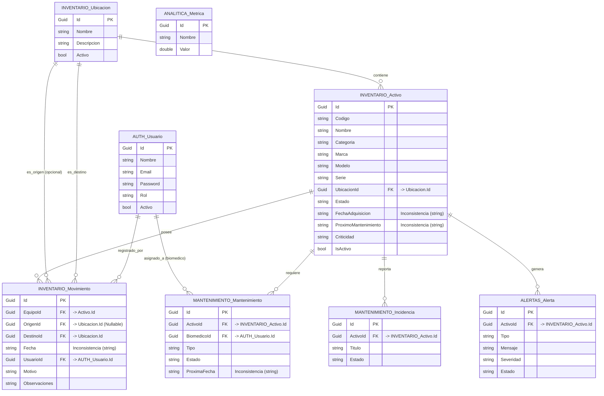

# Diseño de Base de Datos - CREO BioAsset

Este documento describe el modelo de datos **real** implementado en el código fuente actual mediante los distintos DbContext de Entity Framework Core (.NET 8). No refleja el diseño teórico original, sino las clases C# exactas que generan el esquema hoy en día.

## ⚠️ Advertencia sobre Control de Versiones del Esquema (Migraciones)

Actualmente **no existen migraciones EF Core versionadas** (`Migrations/`).
Cada microservicio inicializa su base de datos llamando a `db.Database.EnsureCreated()` (y en algunos casos `CreateTables()`) durante el arranque en `Program.cs`.

- **Impacto:** Si el modelo cambia (por ejemplo, si agregas una columna o cambias un tipo), `EnsureCreated()` **no actualizará** la tabla existente. El sistema fallará en runtime o requerirá borrar la base de datos (pérdida total de datos) para recrearla. Se debe implementar `dotnet ef migrations` para paso a producción.

---

## 1. Esquema `auth` (auth-service)

| Entidad / Tabla | Columna    | Tipo C# (EF) | Nullable | Notas                                                    |
| --------------- | ---------- | ------------ | -------- | -------------------------------------------------------- |
| **Usuario**     | `Id`       | `Guid`       | No       | **PK** (`[Key]`). Generado por defecto `Guid.NewGuid()`. |
|                 | `Nombre`   | `string`     | No       |                                                          |
|                 | `Email`    | `string`     | No       |                                                          |
|                 | `Password` | `string`     | No       | Almacenado como hash SHA256 (Base64).                    |
|                 | `Rol`      | `string`     | No       | Ej: "admin", "biomedico", "asistencial".                 |
|                 | `Activo`   | `bool`       | No       | Default: `true`.                                         |

---

## 2. Esquema `inventario` (inventario-service)

| Entidad / Tabla | Columna                | Tipo C# (EF) | Nullable | Notas                                                          |
| --------------- | ---------------------- | ------------ | -------- | -------------------------------------------------------------- |
| **Ubicacion**   | `Id`                   | `Guid`       | No       | **PK** (`[Key]`)                                               |
|                 | `Nombre`               | `string`     | No       |                                                                |
|                 | `Descripcion`          | `string?`    | Sí       |                                                                |
|                 | `Activo`               | `bool`       | No       | Default: `true`.                                               |
| **Activo**      | `Id`                   | `Guid`       | No       | **PK** (`[Key]`)                                               |
|                 | `Codigo`               | `string`     | No       |                                                                |
|                 | `Nombre`               | `string`     | No       |                                                                |
|                 | `Categoria`            | `string`     | No       |                                                                |
|                 | `Marca`                | `string`     | No       |                                                                |
|                 | `Modelo`               | `string`     | No       |                                                                |
|                 | `Serie`                | `string`     | No       |                                                                |
|                 | `UbicacionId`          | `Guid`       | No       | **FK lógica** hacia `Ubicacion.Id`. (Sin navigation property). |
|                 | `Estado`               | `string`     | No       |                                                                |
|                 | `FechaAdquisicion`     | `string?`    | Sí       | _Inconsistencia de tipo_ (Debería ser DateTime o DateOnly).    |
|                 | `ProximoMantenimiento` | `string?`    | Sí       | _Inconsistencia de tipo_.                                      |
|                 | `Criticidad`           | `string`     | No       | Default: "Media".                                              |
|                 | `IsActivo`             | `bool`       | No       | Mapeado a DB como columna `activo`.                            |
| **Movimiento**  | `Id`                   | `Guid`       | No       | **PK** (`[Key]`)                                               |
|                 | `EquipoId`             | `Guid`       | No       | **FK lógica** hacia `inventario.Activo.Id`.                    |
|                 | `OrigenId`             | `Guid?`      | Sí       | **FK lógica** hacia `inventario.Ubicacion.Id`.                 |
|                 | `DestinoId`            | `Guid`       | No       | **FK lógica** hacia `inventario.Ubicacion.Id`.                 |
|                 | `Fecha`                | `string`     | No       | _Inconsistencia de tipo_.                                      |
|                 | `UsuarioId`            | `Guid`       | No       | **FK lógica cross-schema** hacia `auth.Usuario.Id`.            |
|                 | `Motivo`               | `string`     | No       |                                                                |
|                 | `Observaciones`        | `string?`    | Sí       |                                                                |

---

## 3. Esquema `mantenimiento` (mantenimiento-service)

| Entidad / Tabla   | Columna        | Tipo C# (EF) | Nullable | Notas                                                                           |
| ----------------- | -------------- | ------------ | -------- | ------------------------------------------------------------------------------- |
| **Mantenimiento** | `Id`           | `Guid`       | No       | **PK** (`[Key]`)                                                                |
|                   | `ActivoId`     | `Guid`       | No       | **FK lógica cross-schema** hacia `inventario.Activo.Id`. Mapeado a `activo_id`. |
|                   | `BiomedicoId`  | `Guid`       | No       | **FK lógica cross-schema** hacia `auth.Usuario.Id`. Mapeado a `biomedico_id`.   |
|                   | `Tipo`         | `string`     | No       |                                                                                 |
|                   | `Estado`       | `string`     | No       |                                                                                 |
|                   | `ProximaFecha` | `string?`    | Sí       | _Inconsistencia de tipo_. Mapeado a `proxima_fecha`.                            |
| **Incidencia**    | `Id`           | `Guid`       | No       | **PK** (`[Key]`)                                                                |
|                   | `ActivoId`     | `Guid`       | No       | **FK lógica cross-schema** hacia `inventario.Activo.Id`. Mapeado a `activo_id`. |
|                   | `Titulo`       | `string`     | No       |                                                                                 |
|                   | `Estado`       | `string`     | No       |                                                                                 |

---

## 4. Esquema `alertas` (alertas-service)

| Entidad / Tabla | Columna     | Tipo C# (EF) | Nullable | Notas                                                                           |
| --------------- | ----------- | ------------ | -------- | ------------------------------------------------------------------------------- |
| **Alerta**      | `Id`        | `Guid`       | No       | **PK** (`[Key]`)                                                                |
|                 | `ActivoId`  | `Guid`       | No       | **FK lógica cross-schema** hacia `inventario.Activo.Id`. Mapeado a `activo_id`. |
|                 | `Tipo`      | `string`     | No       |                                                                                 |
|                 | `Mensaje`   | `string`     | No       |                                                                                 |
|                 | `Severidad` | `string`     | No       |                                                                                 |
|                 | `Estado`    | `string`     | No       |                                                                                 |

---

## 5. Esquema `analitica` (analitica-service)

| Entidad / Tabla | Columna  | Tipo C# (EF) | Nullable | Notas            |
| --------------- | -------- | ------------ | -------- | ---------------- |
| **Metrica**     | `Id`     | `Guid`       | No       | **PK** (`[Key]`) |
|                 | `Nombre` | `string`     | No       |                  |
|                 | `Valor`  | `double`     | No       |                  |

---

## 🛑 Inconsistencias de Tipos Detectadas

El uso de **`string` para almacenar Fechas** es un anti-patrón crítico hallado en todo el código fuente:

1. `inventario.Activo.FechaAdquisicion` (string)
2. `inventario.Activo.ProximoMantenimiento` (string)
3. `inventario.Movimiento.Fecha` (string)
4. `mantenimiento.Mantenimiento.ProximaFecha` (string)

Guardar fechas como `string` imposibilita realizar consultas ordenadas por fecha a nivel de base de datos (`ORDER BY fecha DESC`), rangos (`fecha > 'X'`), o cálculos nativos de tiempo en SQL. Deberían ser convertidos a `DateTime` o `DateOnly` antes de salir a producción.

## Diagrama del Modelo de Datos (Mermaid)

> **Nota arquitectónica**: Al estar en microservicios separados, las relaciones entre esquemas (cross-schema) son lógicas. No existen `FOREIGN KEY` constraints físicas a nivel de base de datos para relaciones inter-esquemas, ya que los DbContext no tienen `Navigation Properties` para cruzarse entre ellos.

